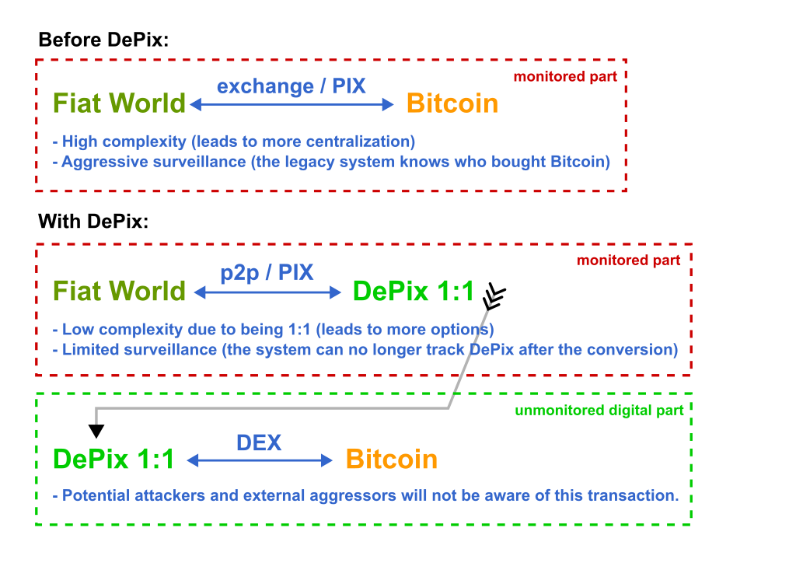

# DePix
**DePix** is a token pegged to the Brazilian Real (BRL) at a 1:1 ratio, operating on the [Liquid network](https://liquid.net/). Although this parity is usual, operational limitations may affect conversion in large volumes, challenges that can be mitigated by "Banking Nodes" and collateral diversification. The risks are well-limited, and DePix offers significant advantages in terms of sovereignty and privacy, especially in confidential Bitcoin operations.

Beyond its connection to the Real, **DePix** stands out as an innovative **Transient Tactful Token (3T)**:

1. **Transient** – its use is temporary, serving as an intermediary between the Real (fiat world) and Bitcoin (digital world), without the intention of being held long-term due to the risk of inflation of its collateral and custody risks.
2. **Tactful** – discreet, leveraging the confidential transaction infrastructure of the Liquid network or similar networks, enhancing privacy in transactions, particularly in the conversion to assets like Bitcoin.

- [Check out our **WHITEPAPER** by clicking here.](./whitepaper/depix_whitepaper-en_US.pdf)

